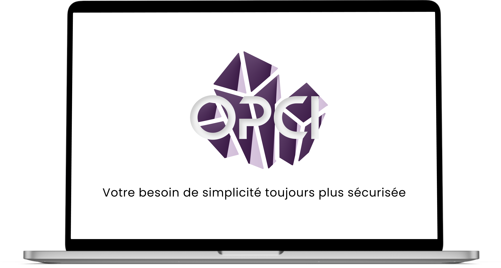
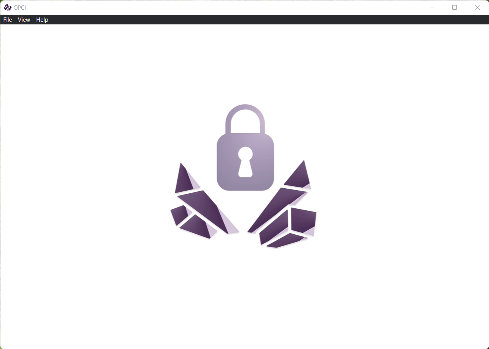
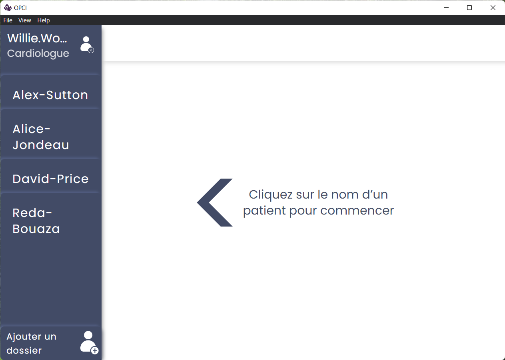
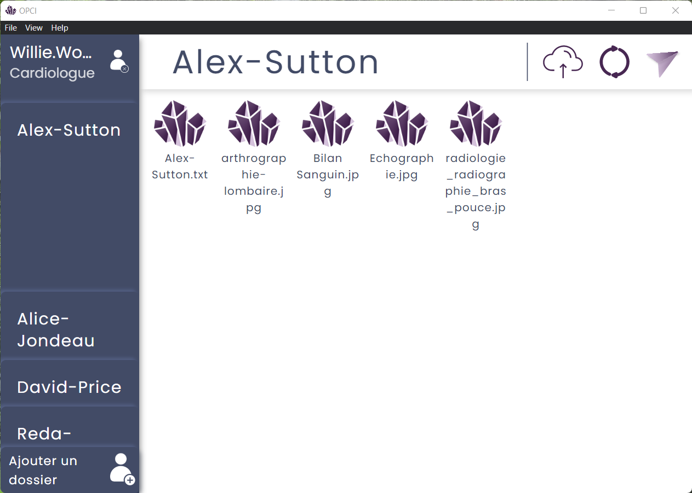
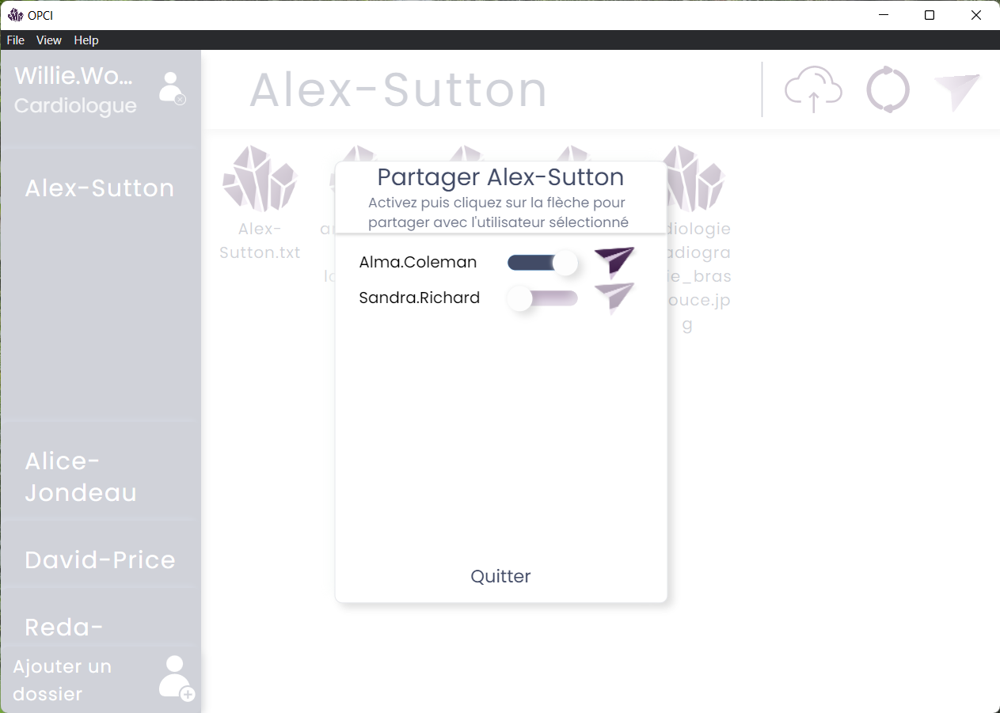

# OPCI-copy
    
This is the copy repository of OPCI project. Onces the project cleaned from sensible information, the source code 
will be added. Waiting it, you'll find in the documentation folder some details about the project and how it has been 
implemented.

## Screenshots
